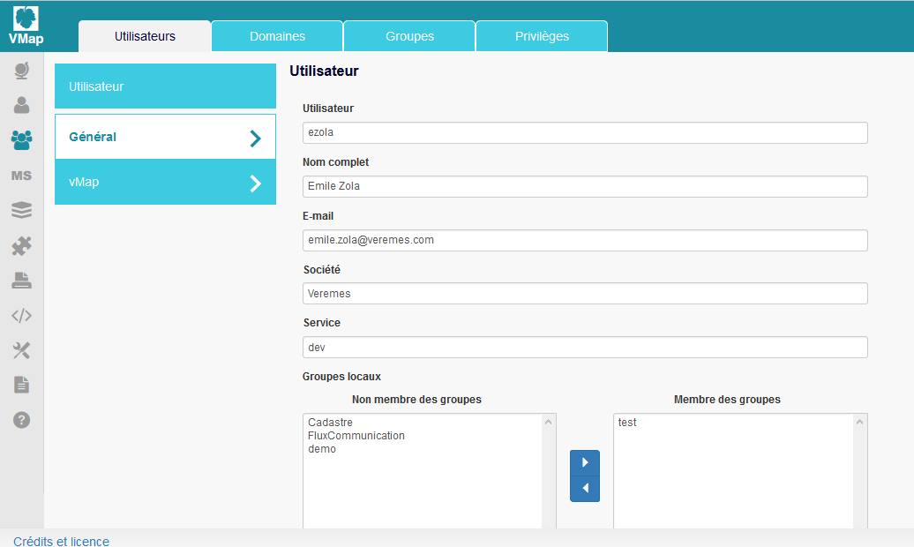

# Gestion des utilisateurs

Un utilisateur vMap est un compte connu par l’application vMap qui peut
se connecter et utiliser ses services.

Deux profils d’utilisateurs sont à distinguer :

-   Utilisateurs PostgreSQL : utilisateurs authentifiés par la base de
    données interne à vmap, PostgreSQL, créés directement dans vMap.
-   Utilisateurs Active Directory (AD) : utilisateurs d’un domaine et
    authentifiés par un annuaire Active Directory, importés dans vMap.

## 1. Création d'utilisateurs et de groupes PostgreSQL

Le mode Utilisateurs > Onglet Utilisateurs liste l’ensemble des
utilisateurs. Il permet l’ajout de nouveaux utilisateurs, leur édition
et suppression. Après avoir cliqué sur ‘Ajouter un utilisateur’, le
formulaire suivant s’affiche :



## 2. Création d'utilisateurs et de groupes d'un annuaire Active Directory

Il est possible de gérer plusieurs domaines et d’exploiter des groupes
de sécurité définis directement dans un annuaire Active Directory.  
L’administrateur a la possibilité d’importer des utilisateurs et des
groupes depuis Active Directory. Cette méthode permet d’hériter des
droits issus de la gestion centralisée AD des utilisateurs au sein d’un
organisme.   L’administrateur crée le nouveau domaine, puis importe les
utilisateurs et les groupes. L’attribution des groupes ainsi que les
mots de passe des utilisateurs ne pourront pas être changés.

### 2.1 Ajout de domaines Active Directory

Le mode Utilisateurs > Onglet Domaines liste les domaines Active
Directory. Il permet de créer, modifier et supprimer des domaines. Le
bouton ‘Ajouter un Domaine’ affiche le formulaire suivant.

L’administrateur saisit les informations suivantes :

-   Type, Nom et Alias du domaine : le nom de domaine utilisé pour
    la connexion. Par exemple,  ‘siege.entreprise.com’.
-   IP ou nom de serveur : adresse IP ou nom du serveur assurant le rôle
    de serveur Active Directory.
-   Dn de base de recherche (utilisateur) : point d’entrée pour la
    recherche des utilisateurs.
-   Dn de base de recherche (groupe) : point d’entrée pour la recherche
    des groupes.
-   Filtre (utilisateur) : permet de définir des filtres pour la
    recherche des utilisateurs.
-   Filtre (groupe) : permet de définir des filtres pour la recherche
    des groupes.
-   Vérifier les droits lors du lancement du robot : permet au robot de
    vérifier si un utilisateur du domaine possède toujours les droits
    lors de l’exécution du traitement. Pour cela le robot a besoin de
    connaître le login et le mot de passe d’un utilisateur du domaine.
-   Login : login d’un utilisateur du domaine.

\* Mot de passe : mot de passe de l’utilisateur du domaine.   Le login
et le mot de passe saisis ici permettent de vérifier les droits de
l’utilisateur Active Directory lors de l’exécution du robot.   En
cliquant sur « Créer » la procédure de création de domaine Active
Directory est finalisée.  


L’administrateur doit ensuite  modifier manuellement le fichier de
configuration de la base de données PostgreSQL pour autoriser la
connexion des utilisateurs du domaine. Dans le répertoire d’installation
de PostgreSQL,  modifier à l’aide d’un éditeur de texte le fichier
pg_hba.conf situé dans le dossier data.

Avant modification vous devriez avoir la configuration suivante :

```
host    all     u_scheduler         127.0.0.1/32    trust
host    all     +superusers         127.0.0.1/32    md5
host    all     all                 127.0.0.1/32    md5
# IPv6 local connections:
host    all     u_scheduler         ::1/128         trust
host    all     +superusers         ::1/128         md5
host    all     all                 ::1/128         md5
```

Vous devez rajouter les deux lignes suivantes :

```
host    all     +gtf_nomdomaine     127.0.0.1/32    ldap ldapserver=nomduserveur ldapprefix=""
host    all     +gtf_nomdomaine     ::1/128         ldap ldapserver=nomduserveur ldapprefix=""
```

Pour obtenir :

```
host    all      u_scheduler        127.0.0.1/32    trust
host    all      +superusers        127.0.0.1/32    md5
host    all      +gtf_nomdomaine    127.0.0.1/32    ldap ldapserver=nomduserveur ldapprefix=""
host    all      all                127.0.0.1/32    md5
# IPv6 local connections:
host    all      u_scheduler        ::1/128         trust
host    all      +superusers        ::1/128         md5
host    all      +gtf_nomdomaine    ::1/128         ldap ldapserver=nomduserveur ldapprefix=""
```

### 2.2 Import d'utilisateurs d'Active Directory

Dans l'onglet Utilisateurs, le bouton « Importer de l’AD » permet
d’importer des utilisateurs à partir d’un serveur Active Directory. Une
interface de connexion apparaît à l’écran. L’administrateur saisit son
login et mot de passe Active Directory afin de se connecter au domaine
précédemment créé.   Une fois la connexion effectuée, l’administrateur
peut soit naviguer dans l’arborescence de l’annuaire du domaine, soit
effectuer une recherche à partir de critères.

## 3 Gestion des privilèges

Les privilèges préfixés par "vitis_" correspondent aux droits propres
au socle de développement Vitis :

-   Le privilège vitis_user permet de se connecter à l'application et
    d'accéder au mode Utilisateur.
-   Le privilège vitis_admin permet l'accès aux modes Utilisateurs,
    Configuration, Logs. Il a en charge la gestion des paramètres
    système et de la configuration de GTF. Il accède également dans le
    mode Aide à la documentation relative à l'API Vitis.

4 profils d'utilisateurs propres à vMap sont disponibles, chacun ayant
des privilèges spécifiques. L'accès aux modes dépend des privilèges
attribués à l'utilisateur.

-   vmap_user = utilisateur de vMap ayant accès aux modes
    Visualisation cartographique.
-   vmap_admin = l'administrateur de l'application a tous les droits.
    En plus des privilèges vitis_admin, il accède au mode Moteurs dans
    lequel il configure les moteurs FME et GTF. Il a en charge la
    gestion des utilisateurs de GTF et de la base de données.
-   vmap_cadatsre_user = utlisateur du module Cadastre de vMap
-   vm4ms_admin = administrateur de vMap4MapServer
