# Onglet objets métiers

# 1. Définition

Un objet métier est une entité qui associe à un calque, les attributs
d’une table ou vue de base de données. De la sorte, les attributs
associés au calque sont affichables et éditables, dans le requêteur et
dans le formulaire de création d’objet, accessibles dans le mode Carte.

Un objet métier permet donc de gérer des données vectorielles stockées
en base.

Le mode Développement permet l’ajout, l’édition et la suppression
d’objets métier.

La création d’un objet métier s’opère en deux temps :

-   La déclaration de l’objet et des paramètres d’affichage
    du requêteur.
-   La construction des formulaires d’affichage, de création, d’édition
    et de recherche de l’objet métier via le studio.

# 2. Création d’un objet métier

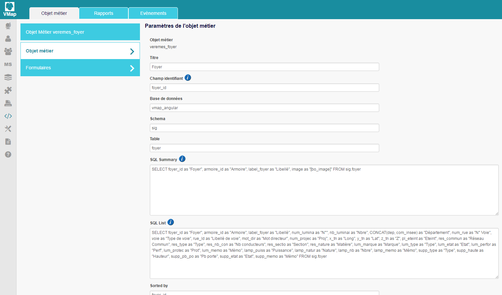

Renseigner les champs suivants :

-   Titre : nom de l’objet métier tel qu’il apparaîtra dans le requêteur
    et dans le formulaire de création d’objet

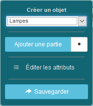

-   Champs id : champ identifiant de la table.
-   Base de données : nom de la base de données à laquelle se connecter
-   Schéma : schéma de la base de données
-   Table : table de la base de données
-   SQL Summary : requête SQL pour définir les champs à afficher dans
    l’infobulle d’un objet :

-   SQL List : requête SQL pour définir les champs à afficher dans la
    liste des objets sélectionnés du requêteur :

# 3. Formulaires

## 3.1. Définitions

Pour chaque objet métier, plusieurs formulaires sont utilisables et
paramétrables :

### 3.1.1. Formulaire de recherche de l’objet métier (search)

Utilisable dans le requêteur et disponible pour les utilisateurs ayant
des **droits en consultation** sur la table liée, il permet de faire des
recherches filtrées sur les enregistrements de l'objet métier.

### 3.1.2. Formulaire d’affichage de l’objet métier (display)

Utilisable par les personnes ayant des **droits en consultation** sur la
table liée, il permet d'afficher des informations en consultation pour
l'enregistrement sélectionné.

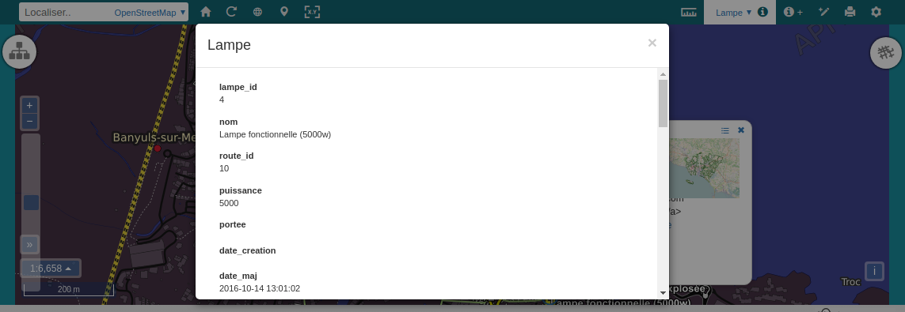

### 3.1.3. Formulaire de mise à jour de l’objet métier (update)

Utilisable par les personnes ayant des **droits de mise à jour** sur la
table liée, il permet de mettre à jour les arguments de l'enregistrement
en édition.

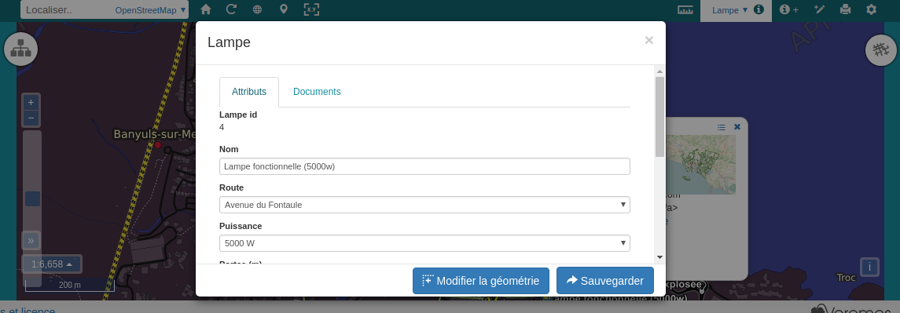

### 3.1.4. Formulaire de création de l’objet métier (insert)

Utilisable par les personnes ayant des **droit en insertion** sur la
table liée et accessible par le bouton **"Éditer les attributs"**, il
permet à l'utilisateur de créer un objet et de renseigner ses attributs.

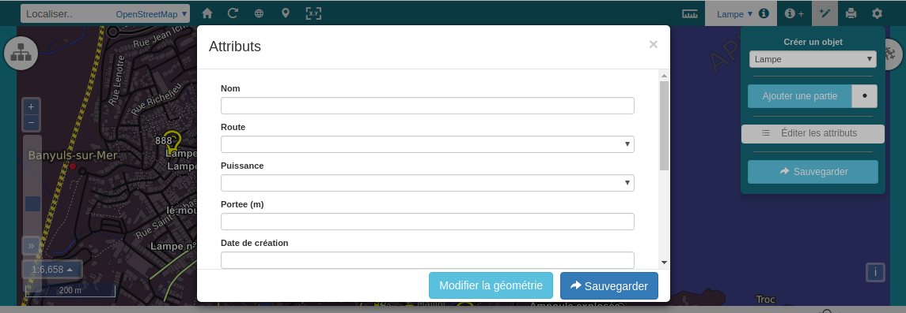

## 3.2 Studio

Afin d'administrer ces formulaires pouvant être très complexes, un
studio a été developpé pour gérer graphiquement les différents
formulaires des objets métier.

Le studio est accessible via la section Formulaire après avoir édité un
objet métier.

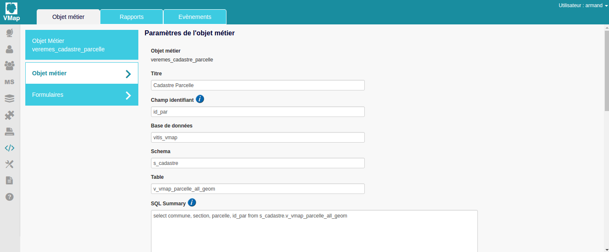

### 3.2.1. Génération automatique des formulaires

La première chose à faire lorsqu'on veut créer un ensemble de
formulaires est de demander à l'application de les générer en fonction
des colonnes présentes sur la table liée. Si le typage en base de
données est bien fait et que cela est possible, le type de champ affiché
dans le formulaire sera également implémenté (texte, nombre, date
etc...).

Pour cela, il suffit de cliquer sur **confirmer** lors de l'affichage du
message suivant :

On peut également cliquer dans le **formulaire par défaut** sur
**Régénérer le formulaire par défaut**.

La fenêtre suivante apparaît et l'utilisateur peut :

-   Sélectionner les arguments à afficher
-   Changer pour chaque champ, le nom qui sera affiché dans le
    formulaire

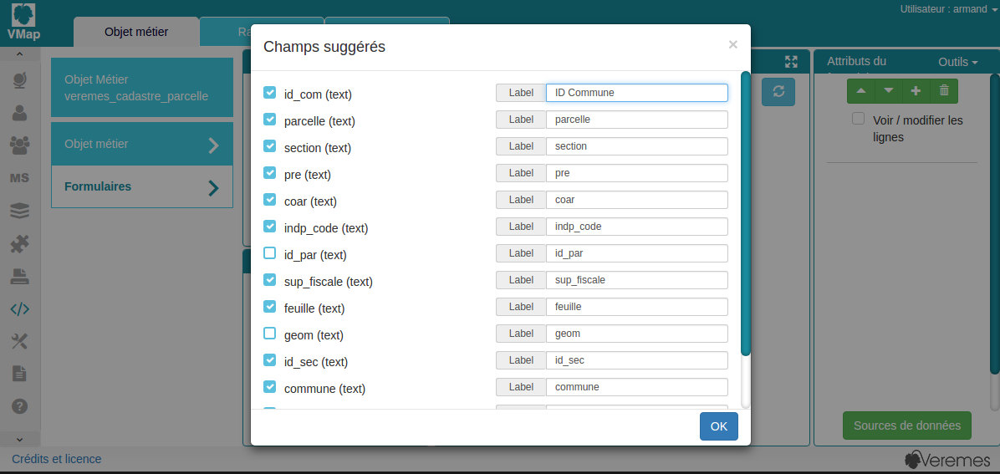

### 3.2.2. Utilisation du studio

Le studio est divisé en quatre principales zones de gestion des
formulaires :

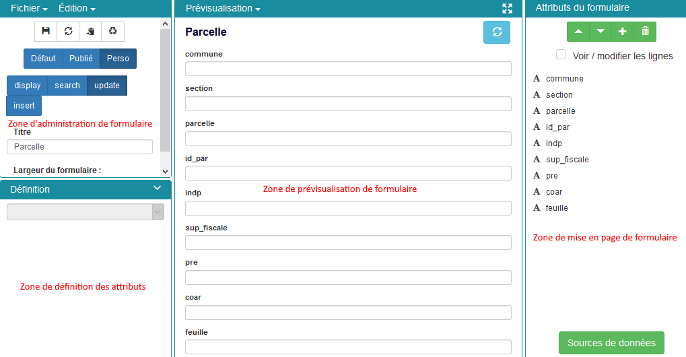

#### 3.2.2.1. La zone d'administration du fichier

Il s'agit d'une des zones fondamentales car elle permet la sauvegarde et
l'affichage des fichiers.

Il existe trois types de formulaires :

-   le **formulaire par défaut**, formulaire généré automatiquement. Le
    développeur peut choisir de conserver en l'état ce formulaire ou de
    le personnaliser.
-   le **formulaire publié**, formulaire en cours d'utilisation dans
    l'application
-   le **formulaire personnalisé**, formulaire en cours d'édition.

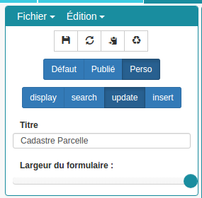

Pour modifier un formulaire, l'administrateur clique sur le bouton
**Perso** puis sélectionne le type de formulaire sur lequel il veut
travailler (display, search, update, insert). Il édite ce dernier et
**publie le formulaire personnalisé** car sans cela les modifications ne
seraient pas visibles par les utilisateurs finaux.

Le menu déroulant **Fichier** permet de gérer les versions des
formulaires (publier le formulaire personnalisé, régénérer le formulaire
par défaut etc..)

Le menu déroulant **Édition&gt; Gestion des onglets** permet d'agencer
le formulaire en répartissant les attributs sur plusieurs onglets.

#### 3.2.2.2. La zone de prévisualisation

La zone de prévisualisation permet à l'administrateur de visualiser en
direct le formulaire en cours.

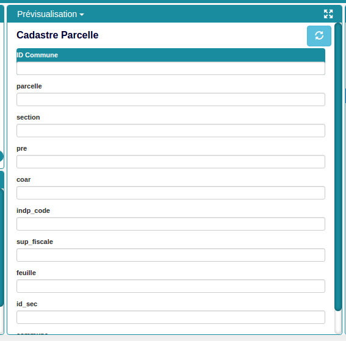

Le menu déroulant **Prévisualisation** permet l'affichage et la
modification de la définition du formulaire au format JSON ainsi que
l'ajout de JavaScript au formulaire.

> **note**
>
> Les onglets ne sont volontairement pas affichés dans cette zone. Ils
> sont affichés lors de l'utilisation réelle du formulaire.

#### 3.2.2.3. La zone de gestion de mise en page

Dans cette zone, l'administrateur peut modifier l'ordre d'affichage des
attributs, et via la case "Voir / modifier les lignes", il peut
regrouper plusieurs éléments sur une même ligne.

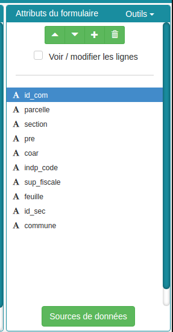

Le bouton **Sources de données** en bas de zone, permet la configuration
des attributs de type liste. En savoir plus sur le [Gestionnaire de
source de données](cas_utilisation_studio.html)

#### 3.2.2.4. La zone de définition de l'attribut sélectionné

Dans cette zone, l'administrateur pourra gérer le type de saisie qui
sera faite, le libellé à afficher sur le formulaire, le nom de la
colonne auquel il est lié et bien d'autres paramètres en fonction du
type d'attribut.

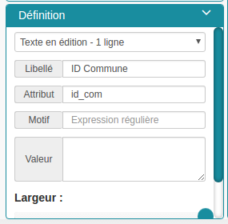

### 3.2.3. Utilisation du studio

Pour comprendre comment utiliser le studio vous pouvez aller voir le
document [Cas concrets d'utilisation du studio dans
vMap](cas_utilisation_studio.html)
