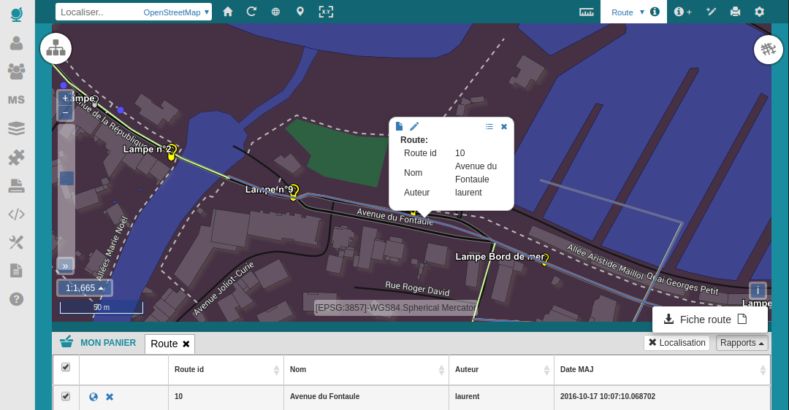
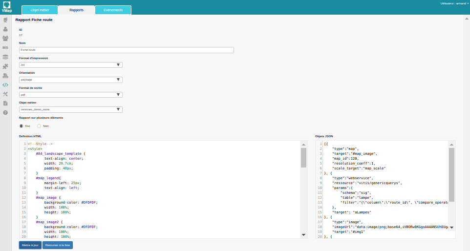

# Rapports objets métiers


# 1. Définition

Un rapport sur un objet métier permet de générer des fichiers au format
.pdf ou .doc sur les informations relative à un un objet sélectionné
dans le panier.

Deux types de rapports sont à distinguer :

-   Les rapports sur un élément 
-   Les rapports sur plusieurs éléments 

Si un utilisateur sélectionne plusieurs entités et lance un rapport sur
un élément, alors plusieurs fichiers sont générés. Inversément, si il
lance un rapport sur plusieurs éléments, un seul fichier contenant les
informations de chacun des éléments est généré.


# 2. Utilisation

Pour générer un rapport sur objet métier, sélectionner un objet sur la
carte en cliquant dessus, l'ajouter au panier, puis sélectionner les
objets dans le panier et enfin à l'aide du bouton "Rapports", générer le
rapport voulu.



# 3. Administration

L'onglet Rapports du menu Développement permet la création, l'édition et
la suppression de rapports.

Dans l'interface d'administration renseigner les éléments suivants :

-   Nom : nom affiché dans l'interface
-   Format d'impression : A4/A3
-   Orientation : portrait/paysage
-   Format de sortie : pdf/doc
-   Objet métier : objet métier sur lequel le rapport doit être associé
-   Rapport sur plusieurs éléments : pour générer un ou plusieurs
    documents lors de sélections multiples
-   Définition HTML : permet de configurer la mise en page
-   Objets JSON : permet une configuration plus avancée



## 3.1. Configuration de la définition HTML

Le bloc de défintion HTML permet de configurer la mise en page du
rapport. Il est recommandé de procéder en trois parties :

-   le style : balise style qui contiend la définition CSS à utiliser.
-   le corps : balises HTML de mise en page.
-   le script : balise script qui lance du JavaScript lors de la
    génération (gestion des sauts de page, par exemple).

### 3.1.1. Utilisation des variables

Dans le corps, la librairie AngularJS est accessible, c'est à dire que
l'on peut utiliser la syntaxe suivante pour afficher le contenu d'une
variable :

``` html
<label class="fichelabel">Nom: {{BO.nom}}</label>
```

Dans l'exemple ci-dessus, la variable BO est présente par défaut et
contient les attributs de l'objet résultant (notez que pour un rapport à
plusieurs éléments, elle se compose d'un tableau contenant les divers
objets retournés).

Avec la librairie AngularJS, on peut facilement effectuer des boucles,
des conditions, des changements de style etc..

Ci-après, un exemple permettant de faire une boucle et lister les lampes
d'une route :

``` html
<!--Description des lampes de la route-->
<div ng-repeat="oLampe in aLampes" ng-if="oLampe.lampe_id!=undefined" class="description_box border_container">
    <label class="fiche_label">Lampe: {{oLampe.nom}}</label>
    <label class="fiche_label">Id: {{oLampe.lampe_id}}</label>
    <label class="fiche_label">Puissance: {{oLampe.puissance}}</label>
    <label class="fiche_label">Allumée: {{oLampe.allume ? 'Oui' : 'Non'}}</label>
</div>
```

### 3.1.2. Affichage de la carte dans un rapport

Si on veut afficher une ou plusieurs cartes dans un rapport, créer dans
une première partie, une balise image avec l'"id" de son choix (il est
conseillé d'utiliser un fond transparent au cas où les tuiles ne se
chargent pas lors de l'impression) :

``` html

```

La seconde partie de la manipulation consiste à paramétrer un objet JSON
pour indiquer à vMap la carte à utiliser et la façon dont l'utiliser. Se
référer à la partie [3.2.1. Configuration des cartes à utiliser dans le
template
HTML](#3.2.1-configuration-des-cartes-a-utiliser-dans-le-template-html)

## 3.2. Configuration des objets JSON

Pour bien configurer un rapport, il est utile de configurer la partie
Objets JSON. Le but est de pouvoir ajouter des cartes au rapport,
interroger des webservices ou afficher des images. Pour cela, créer en
JSON, un tableau contenant les différentes configurations. Chacune
d'elle est typée avec l'argument "type".

Exemple:

``` json
[{
    "type":"map",
    "target":"#map_image",
    "map_id":120,
    "resolution_coeff":1,
    "scale_target":"map_scale"
}, {
    "type":"webservice",
    "ressource":"vitis/genericquerys",
    "params":{
        "schema":"sig",
        "table":"lampe",
        "filter":"{\"column\":\"route_id\", \"compare_operator\":\"=\", \"value\": \"{{BO.route_id}}\"}"
    },
    "target": "aLampes"
}, {
    "type":"object",
    "content":{
        "company":"Veremes"
    },
    "target": "scope"
}]
```

### 3.2.1 Configuration des cartes à utiliser dans le template HTML

On peut inclure des cartes dans les formulaires en utilisant des objets
de type "map" avec les paramètres suivants :

-   target : cible sur laquelle doit se poser la carte ("\#" +
    l'identifiant de votre balise image)
-   map\_id : identifiant de la carte à utiliser
-   resolution\_coeff : coefficient de résolution
-   scale\_target : nom de la variable qui contiend l'échelle de la
    carte dans le template HTML

Exemple:

``` json
{
    "type":"map",
    "target":"#map_image",
    "map_id":120,
    "resolution_coeff":1,
    "scale_target":"map_scale"
}
```

Ici on vient afficher le(s) objets métier sur la carte 120 dans la
balise image "\#map\_image" tout en mettant son échelle dans la variable
"map\_scale".

### 3.2.2. Configuration des webservices

On peut demander à effectuer des requêtes vers des webservices vMap
(PHP) pour afficher le résultat dans la vue HTML au travers de variables
nommées. Il faut, pour cela, utiliser le type "webservice" et utiliser
les paramètres suivants :

-   ressource : ressource à interroger
-   params : paramètres à utiliser lors de l'interrogation
-   target : nom de la variable créée qui contiend les informations
    retournées

**Important**: tout comme dans la Définition HTML, on peut utiliser des
doubles accolades pour utiliser une variable BO.

Exemple:

``` json
{
    "type":"webservice",
    "ressource":"vitis/genericquerys",
    "params":{
        "schema":"sig",
        "table":"lampe",
        "filter":"{\"column\":\"route_id\", \"compare_operator\":\"=\", \"value\": \"{{BO.route_id}}\"}"
    },
    "target": "aLampes"
}
```

Dans cet exemple, une requête au webservice vitis/genericquerys permet
d'interroger de façon générique des tables. Avec cet appel et en
utilisant les doubles accolades {{BO.route\_id}}, l'ensemble des lampes
contenues dans la route sont affichées.

### 3.2.2. Configuration des images

On peut afficher des images pré-définies en utilisant le type image et
les paramètres suivants :

-   imageUrl : URL de l'image (peut être une définition base-64)
-   target : cible sur laquelle doit se poser l'image ("\#" +
    l'identifiant de votre balise image)

Exemple :

``` json
{
    "type":"image",
    "imageUrl":"data:image/png;base64,iVBORw0KGgoAAAANSUh...",
    "target":"#img1"
}
```

# 4. Exemple complet

Ci-dessous un exemple complet actuellement visible sur
[https://demo.veremes.net/vmap/?map\\\_id=29](https://demo.veremes.net/vmap/?map\_id=29).
Dans cet exemple, un projet d'éclairage public contient deux entités :

-   les routes
-   les lampes

Chaque lampe est associée à une route

## 4.1 Définition HTML

``` html
<!--Style-->
<style>
    .A4_landscape_page {
      width: 29.7cm;
      height: 21cm;
      padding: 40px;
    }
    #map_legend{
        margin-left: 25px;
        text-align: left;
    }
    #map_image {
        background-color: #DFDFDF;
        width: 100%;
        height: 100%;
    }
    #map_image2 {
        background-color: #DFDFDF;
        width: 100%;
        height: 100%;
    }
    #map_overview {
        background-color: #DFDFDF;
        height: 4cm;
        width: 4cm;
    }
    .border_container{
        border: 1px solid black;
    }
    .description_box{
        text-align: left;
        padding: 5px;
        margin-bottom: 10px;
    }
    .fiche_urb_label {
        font-size: 10px;
        width: 100%;
        margin-bottom: 0px;
    }
    #img1{
        height: 1cm;
        margin-top: 10px;
        margin-bottom: -10px;
    }
    .main_infos_column{
        height:100%;
        width:100%;
        position: relative;
        min-height: 1px;
        padding-right: 15px;
        padding-left: 15px;
    }
    .infos_column {
      height: 100%;
      border: 1px solid black;
    }
</style>

<!-- A4 print Template -->
<div id="A4_landscape_template" class="A4_landscape_page" style="text-align: center">

    <div class="row" style="padding-left: 10px;">
        <div class="col-xs-4">
            <div class="border_container main_infos_column infos_column">
                
                <hr>
                <h4>Fiche Route</h4>
                <hr>

                <!--Description de la route-->
                <div class="description_box border_container">
                    <label class="fiche_urb_label">Nom: {{BO.nom}}</label>
                    <label class="fiche_urb_label">Id: {{BO.route_id}}</label>
                    <label class="fiche_urb_label">Auteur: {{BO.auteur}}</label>
                    <label class="fiche_urb_label">Date d'édition: {{BO.date_maj}}</label>
                    <label class="fiche_urb_label">Echelle: {{map_scale}}</label>
                </div>

                <br>

                <!--Description des lampes de la route-->
                <div ng-repeat="oLampe in aLampes" ng-if="oLampe.lampe_id!=undefined" class="description_box child_description_box border_container">
                    <label class="fiche_urb_label">Lampe: {{oLampe.nom}}</label>
                    <label class="fiche_urb_label">Id: {{oLampe.lampe_id}}</label>
                    <label class="fiche_urb_label">Puissance: {{oLampe.puissance}}</label>
                    <label class="fiche_urb_label">Allumée: {{oLampe.allume ? 'Oui' : 'Non'}}</label>
                </div>
            </div>
        </div>
        <div class="col-xs-8" style="height: 710px">
            <div style="height: 100%; border: 1px solid black;">
                
            </div>
        </div>
    </div>
</div>

<script>
setTimeout(function () {

  var aElems = $('.child_description_box');
  var aPages = [$('#A4_landscape_template')];
  var currentPage = 0;
  var aBottom = [];
  var iTotalHeight = 0;

  var createPage = function() {
    // Page
    var newPage = document.createElement("div");
    $(newPage).addClass('A4_landscape_page');
    // Zone d'informations
    var newInfosColumn = document.createElement("div");
    $(newInfosColumn).addClass('infos_column');
    $(newInfosColumn).css({
      "padding": "15px"
    });
    // Ajout des éléments
    $(newPage).append(newInfosColumn);
    $('#A4_landscape_template').parent().append(newPage);
    // Sauvegarde de la page
    aPages.push($(newPage));
    currentPage++;
    // Mise à jour de iTotalHeight
    iTotalHeight = getPagesHeight();
    return newPage;
  }

  var getBottomPositions = function(aElems) {
    var aBottoms = [];
    for (var i = 0; i < aElems.length; i++) {
      var iTop = $(aElems[i]).position().top;
      var iHeight = $(aElems[i]).height();
      var iBottom = iTop + iHeight;
      aBottoms.push(iBottom);
    }
    return aBottoms;
  }

  var getPagesHeight = function() {
    var aPagesBotomPositions = getBottomPositions(aPages);
    return aPagesBotomPositions[aPagesBotomPositions.length -1];
  }

  var moveElements = function(aElemsToMove, iPage) {
    for (var i = 0; i < aElemsToMove.length; i++) {
      $(aElemsToMove[i]).appendTo($(aPages[iPage]).find('.infos_column'));
    }
  }

  var pagineChilds = function(){

    aBottom = getBottomPositions(aElems);
    iTotalHeight = getPagesHeight();

    for (var i = 0; i < aElems.length; i++) {

      // Quand un élément est plus bas que la dernière page
      if (aBottom[i] > iTotalHeight - 20) {

        // Crée une nouvelle page
        var newPage = createPage();

        // Déplace les éléments qui suivent sur la nouvelle page
        var aElemsToMove = [];
        for (var ii = i; ii < aElems.length; ii++) {
          aElemsToMove.push(aElems[ii]);
        }
        moveElements(aElemsToMove, aPages.length - 1);

        // Relance la fonction
        pagineChilds();
        return 0;
      }
    }
  }

  pagineChilds();
});
</script>
```

## 4.2. Objets JSON

``` json
[{
    "type":"map",
    "target":"#map_image",
    "map_id":120,
    "resolution_coeff":1,
    "scale_target":"map_scale"
}, {
    "type":"webservice",
    "ressource":"vitis/genericquerys",
    "params":{
        "schema":"sig",
        "table":"lampe",
        "filter":"{\"column\":\"route_id\", \"compare_operator\":\"=\", \"value\": \"{{BO.route_id}}\"}"
    },
    "target": "aLampes"
}, {
    "type":"image",
    "imageUrl":"data:image/png;base64,iVBORw0KGgoAAAANSUhE...",
    "target":"#img1"
}, {
    "type":"object",
    "content":{
        "company":"Veremes"
    },
    "target": "scope"
}]
```
