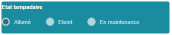
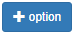

Attributs de formulaire
===========

1 Définition
-------------

Les attributs d'un formulaire peuvent être créés, édités et supprimés dans le studio. Certains attributs exploitent des valeurs issues de base de données ou de services web, d'autres sont des composants de mise en page destinés à personnaliser l'interface  du formulaire, et d'autres sont des attributs classiques directement configurables dans vMap. 

Il existe plus d'un vingtaine de types d'attributs paramétrables dans la fenêtre de définition en bas à gauche du studio. 

   **Un nom d'attribut ne peut pas contenir d'espace.** 
 

2 Edition des attributs 
------------------------------

2.1 Bouton radio 
~~~~~~~~~~~~

Nomme le paramètre et son libellé tel qu'il sera affiché dans le formulaire. Définir la valeur par défaut et déterminer si le bouton radio doit être désactivé ou pas. Définir ensuite les options possibles en entrant le libellé du bouton et la valeur envoyée en base. 
Le bouton 

permet de rajouter une option supplémentaire. 

2.2 Boîte à cocher
~~~~~~~~~~~~

2.3 Carte Bing
~~~~~~~~~~~~~~~~

2.4 Carte OSM 
~~~~~~~~~~~~~~

2.5 Carte vMap
~~~~~~~~~~~~~~

2.6 Champ caché 
~~~~~~~~~~~~

2.7 Couleur 
~~~~~~~~~~~~

2.8 Curseur 
~~~~~~~~~~~~

2.9 Date 
~~~~~~~~~~

2.10 Date et heure
~~~~~~~~

2.11 Document - objet métier 
~~~~~~~~

2.12 Décimal
~~~~~~~~

2.13 Editeur de code CodeMirror
~~~~~~~~

2.14 Entier
~~~~~~~~

2.15 Grille objet métier 
~~~~~~~~

2.16 Grille section vitis
~~~~~~

2.17 Image Objet métier 
~~~~~~~~~~~~

2.18 Image URL 
~~~~~~~~~~

2.19 Interface bouton
~~~~~~

2.20 Interface ligne de séparation 
~~~~~~

2.21 Label 
~~~~

2.22 Lien 
~~~~

2.23 Liste 
~~~~~~

2.24 Texte 
~~~~

 

