Cas concrets d'utilisation du studio dans vMap
==============================================

Ce document décrit des exemples d'utilisation du studio utiles pour comprendre son fonctionnement ainsi que l'intégralité de l'application. 

Personnalisation d'un formulaire : répartition d'attributs sur plusieurs onglets
--------------------------------------------------------------------------------

L'exemple ci-dessous illustre l'agencement d'un formulaire en deux onglets : 

- l’onglet *Attributs* dans lequel  les attributs de type textuel sont issus de base de données 
- l'onglet *Documents* qui contient les attributs de type document

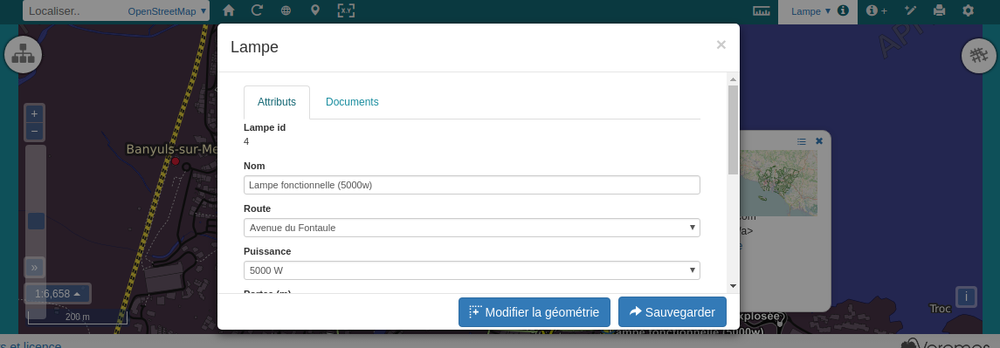
   

Le gestionnaire d'onglets est accessible via le  bouton **Édition > Gestion des onglets** dans la zone d'administration des formulaires : 

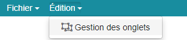

Une fois l'outil affiché, il est possible de cocher ou décocher les
attributs à afficher sur les différents onglets tout en ayant un aperçu
en zone de prévisualisation.

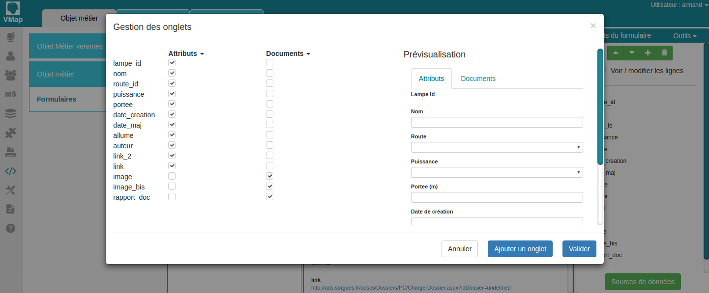
   

Le bouton *Ajouter un onglet* permet l'insertion de nouveaux onglets et
on peut également effectuer des opérations comme renommer, supprimer ou
déplacer des onglets en cliquant sur leur nom.

**Remarque : un attribut peut se situer sur plusieurs onglets à la fois,
ceci peut être utile pour afficher un label. **

Insertion d'un attribut de type lien personnalisé vers un service externe
---------------------------------------------------------------------

Il est souvent utile, lors de l'utilisation d'un objet métier, de mettre en place des liens vers d'autres plateformes.

Dans vMap ceci est possible à deux endroits distincts :

Dans l'info-bulle d'un objet
~~~~~~~~~~~~~~~~~

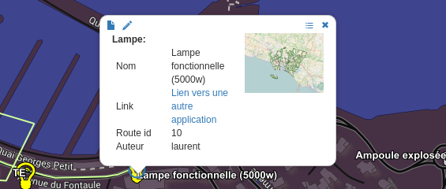

Il faut modifier l'attribut **SQL Summary** dans la
définition de l'objet métier et utiliser des balises *"bo\_link"*.

Exemple :

.. code:: sql

    select nom as "Nom", '[bo_link href="https://www.google.fr/?gws_rd=cr&ei=h3hvWbHuJIORaPe3ofAG#q='||nom||'" target="_blank"]Lien vers une autre application[/bo_link]' as "Link", route_id as "Route id", auteur as "Auteur", image as "[bo_image]"  from sig.lampe

**Il est possible de concaténer une des valeurs de l'enregistrement avec le lien :** dans l'exemple ci-dessus la valeur "*nom*" est concaténée à la fin de l'URL pour effectuer une recherche Google du nom de
l'enregistrement sélectionné.

**Il est possible de concaténer une propertie avec le lien :** en écrivant **{{getPropertie('[nom de la propertie]')}}**.
Dans l'exemple ci-dessous, la valeur de la propertie "*services_alias*" est affichée dans l'info-bulle.

.. code:: sql
   
   select nom as "Nom", route_id as "Route id", auteur as "Auteur", image as "[bo_image]", '{{getPropertie(''services_alias'')}}' as "service_alias" from sig.lampe

On peut également définir l'attribut *target* qui permet de choisir
un nouvel onglet à chaque fois si on donne pour valeur "*\_blank*" ou
alors de stipuler un nom pour utiliser toujours le même onglet.

Dans le formulaire
~~~~~~~~~~~~~~~~~~

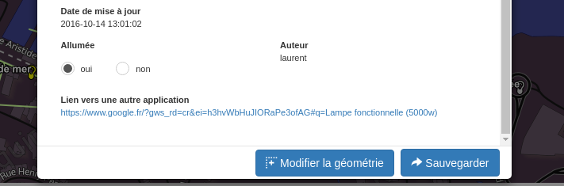

On peut effectuer la même opération en personnalisant le formulaire en insérant un
attribut de type *"Lien"* et en utilisant les fonction *"concat"* et
*"getFormValue"* dans le champ *"Valeur"*.

::

    concat('https://www.google.fr/?gws_rd=cr&ei=h3hvWbHuJIORaPe3ofAG#q=', getFormValue('nom'))

En utilisant les champs *"Texte"* et *"Cible"* on peut également
modifier le texte à afficher ainsi que l'onglet cible.

Utilisation du gestionnaire de source de données : insertion d'une liste déroulante avec source de données
------------------------------------------------------------------------------------------------------------
Le gestionnaire de sources de données permet la création, l'édition et la suppression de sources de données à associer à des attributs de type : 

- liste
- liste déroulante

Le gestionnaire de sources de données permet d'exploiter des données : 

- Texte : valeurs saisies directement dans le gestionnaire
- Valeur de table locale : valeurs issues d'une table de base de données installée sur le même serveur que vMap
- Base de données externe : valeurs importées d'une table d'une base de données externe
- Service web Vitis : permet d'exploiter un service web pour en récupérer les ressources
- Objet métier : permet d'exploiter un objet métier déjà configuré

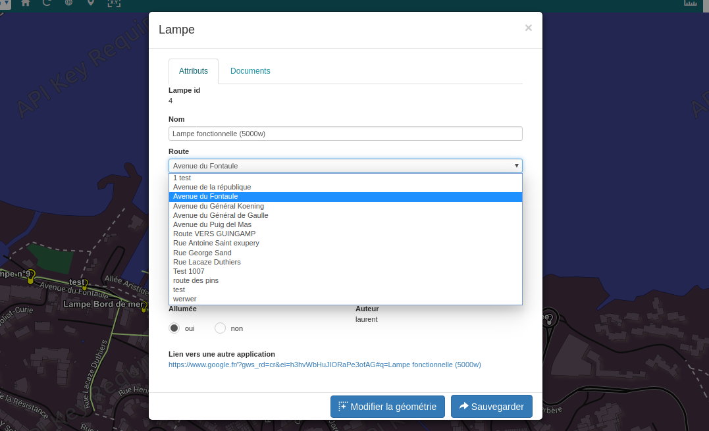

Le bouton  **Sources de données**, en 
bas à droite du studio permet d'ouvrir le gestionnaire de source de données. 

Dans l'exemple ci-dessous, il s'agit d'afficher l'ensemble des routes contenues dans la
table *"route"* et dont l'auteur est *"laurent"*.

On peut utiliser le bouton *"+"* pour ajouter des nouveaux filtres et le
bouton *"Test"* pour tester la source de données.

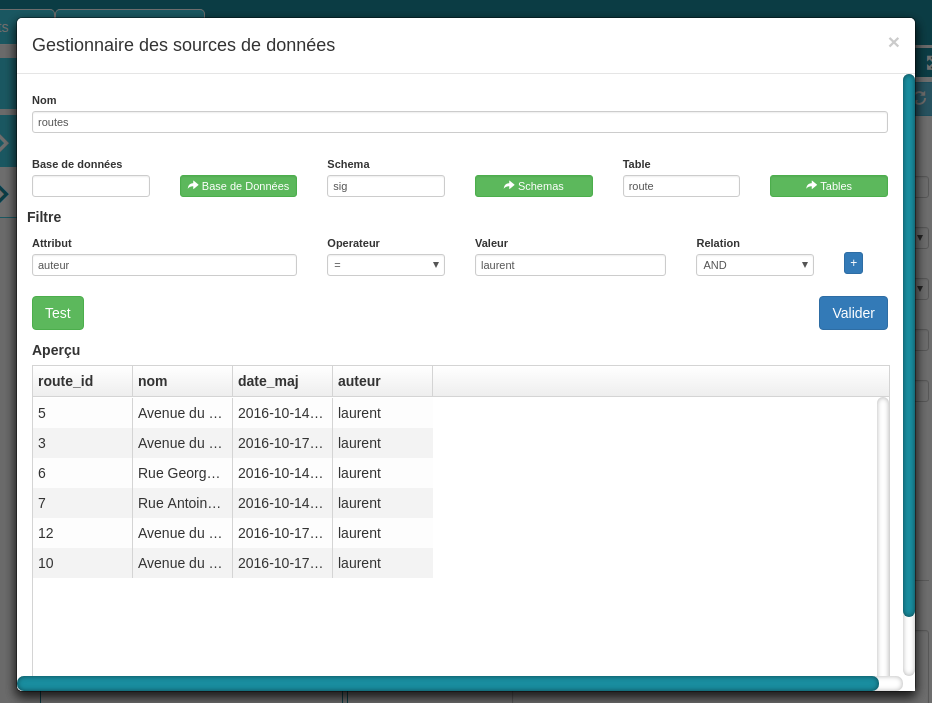

Une fois la source de données renseignée, on peut créer un attribut de
type "*Liste déroulante*" (ou autre type de liste) et choisir
la source de données mise en place précédemment.

Une liste est définie par une "*Clé*" qui est la valeur retournée
lorsqu'on sélectionne un élément de la liste et d'un "*Libellé*" qui est
ce que l'utilisateur voit dans la liste.

Dans cet exemple, on souhaite sélectionner une route à associer à la lampe en
édition. Chaque route est définie par un identifiant numérique
(route\_id) et elle possède un nom textuel (nom) :  on sélectionne donc
"*nom*" en tant que libellé et "*route\_id*" en tant que clé.

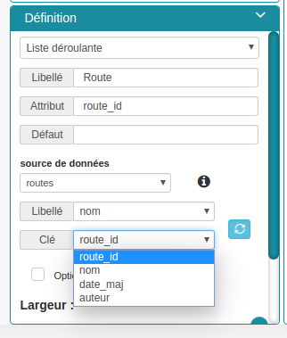

Source de données de type texte
~~~~~~~~~~

Le type texte permet de renseigner soi-même le contenu de la source de
données.

::

    libellé 1|clé 1
    libellé 2|clé 2
    libellé 3|clé 3

Chaque entité est composée d'une **clé** qui est la valeur retenue et
d'un **libellé** qui est le contenu affiché. Les deux sont séparés
(sans espace) par le caractère "\|" et on peut répéter l'opération
autant de fois que l'on veut, en allant à la ligne pour chaque élément.

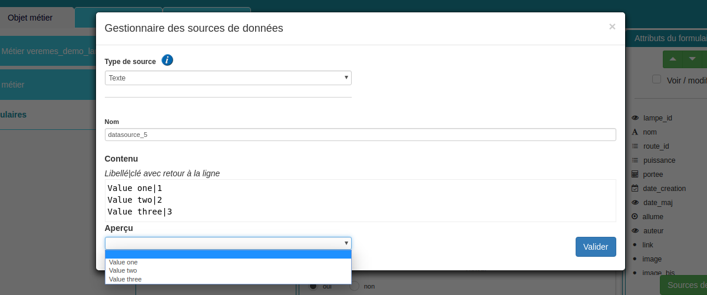

Source de données de type valeurs d'une table locale
~~~~~~~~~~~~~~~~~~~~~~~~~~~~~~~

Type utilisé lors de l'exemple précédent, il permet d'aller directement
chercher en base de données (sur le serveur en cours) le contenu d'une
table.

On peut également ajouter une ou plusieurs conditions à l'aide de
filtre.  Pour cela il suffit de renseigner une "*Valeur Clé*" qui est
un nom de colonne de la table, un "*Opérateur*" dans le
liste fournie et une "*Valeur*" qui correspond à la valeur à utiliser pour la
condition. Le bouton "*+*" permettra d'ajouter des conditions et on
peut également décider si les conditions sont de type "*AND*" ou
"*OR*" grâce à une liste déroulante.

**Important :** lors de son utilisation, ce genre de source de données
utilise le token de connexion de l'utilisateur.  Il faut donc faire
attention à ce que **tous les utilisateurs susceptibles d'utiliser le
formulaire aient des droits en consultation sur la table.**

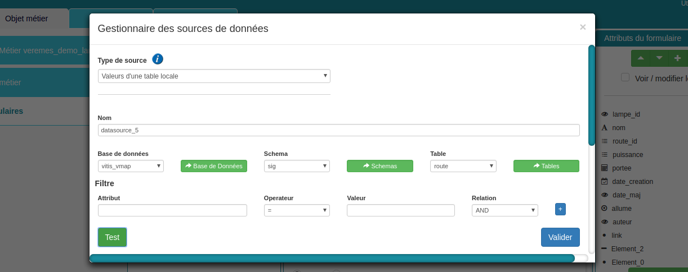

Source de données de Type service web
~~~~~~~~~~~~~~~~

Parfois, le type "*Valeurs d'une table locale*" ne suffit pas car on veut
utiliser une ressource d'un service web précédemment créé, afin
d'effectuer des requêtes complexes. On peut aussi souhaiter se
servir d'un services de l'application.

Pour cela,  on utilise le type "*Service web*" qui effectue
une requête de type "*GET*" à la ressource en question.

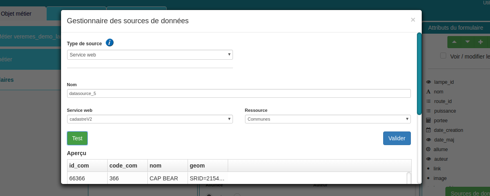

Source de données de type objet métier
~~~~~~~~~~~~~~~~~

Il est également possible d'interroger directement un objet métier
selon une des trois solutions suivantes :

-  **Form :** renvoie l’ensemble des colonnes de la table associée à
   l'objet métier
-  **SQL Summary :** renvoie de résultat de la requête définie par SQL
   Summary
-  **SQL List :** renvoie de résultat de la requête définie par SQL List

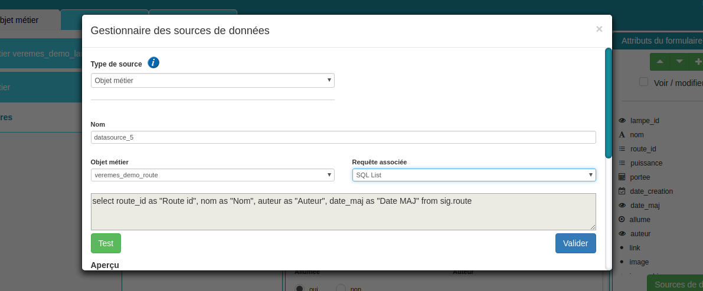

Source de données de type base de données externe
~~~~~~~~~~~~~~~~~~~~~~~~~~~~

Plus complexe mais plus puissant,  ce type de source permet d'interroger des bases de
données d'un serveur externe selon un login et un mot de
passe fourni.

**Important : les login et mot de passe renseignés doivent être publics**
car les utilisateurs finaux pourraient avoir accès à cette information.

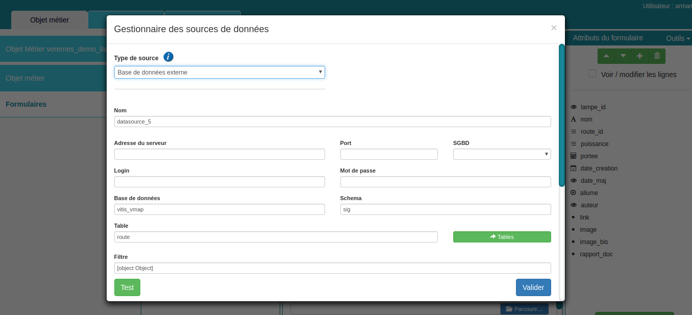

Insertion d'un attribut de type carte  : affichage d'une carte personnalisée
--------------------------------------------------------------------

Le studio permet d'exploiter les services web OSM, Bing Maps ou Vitis vMap pour personnaliser un formulaire en exploitant leurs ressources cartographiques. 

L'utilisateur final peut, de la sorte, visualiser et saisir de la géométrie en exploitant la carte comme support de saisie.

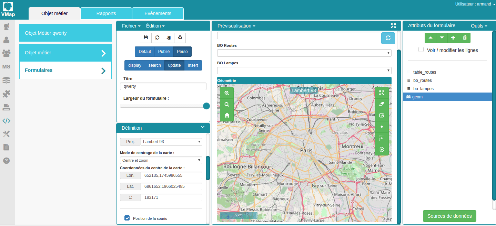

Trois types de cartes sont disponibles :

-  **Carte OSM :** carte contenant une couche OSM
-  **Carte Bing :** carte contenant une couche Bing (nécessite une
   clé)
-  **Carte vMap :** carte complexe pouvant contenir plusieurs couches et
   définie par un fichier JSON téléchargeable depuis **Mode vMap >
   Cartes > Gestion des cartes > Ma carte > Télécharger**

Une fois la carte sélectionnée, l'administrateur peut définir l'emprise de la
carte en naviguant simplement dessus ou en renseignant les champs
"*Long*" pour la longitude, "*Lat*" pour la latitude et "*1:*" pour
l'échelle. Si le mode de centrage de la carte est défini sur "*Étendue*",  saisir les valeurs "*XMin*", "*YMin*", "*XMax*", "*YMax*. 

Les outils disponibles lors de l'utilisation sont configurables
graphiquement via les boites à cocher de la zone "*Définition*".

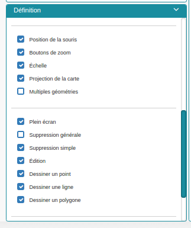

Insertion d'un champs de chargement de Document/Image 
----------------------------------------

Il est possible d'associer des documents ainsi que des images aux
enregistrements liés à un objet métier en utilisant respectivement les
types "*Document - Objet métier*" et "*Image - Objet métier*".

Une boite à cocher "*Uniquement en consultation*" permet de définir si
l'utilisateur peut visualiser et éditer ce champs ou alors uniquement le
visualiser.

Si elles existent, les images sont automatiquement affichées tandis que les documents sont disponibles en
téléchargement.

+-----------+------------+
| Studio    | Résultat   |
+===========+============+
| |image|   | |image|    |
+-----------+------------+

Les documents résultants sont stockés dans le répertoire suivant et
seul leur nom est stocké en base :

::

    {dossier vMap}/vas/ws_data/vitis/{nom de l'objet métier}/{identifiant de l'enregistrement}/{nom de l'attribut}/{nom du fichier}

**Remarque : seulement un fichier peut être associé à un attribut**, si
plusieurs fichiers doivent être téléversés, il faut créer
plusieurs attributs ou sinon les compresser dans un fichier .zip

Grille de sous-objets avec possibilité d'ajout, de suppression et d'édition
---------------------------------------------------------------------------

Il est assez régulier d'avoir plusieurs objets métiers qui dépendent les
uns des autres. Dans ce cas, il est très utile lors de l'édition d'un
objet parent, de visualiser la liste des sous-objets liés à ce dernier.

Dans l'exemple ci-joint, c'est l'objet métier "*Route*" qui joue le rôle du
parent. Un enregistrement peut etre constitué de plusieurs "*Lampes*".

Dans vMap, il est possible d'afficher les listes parents/enfants
en donnant la possibilité d'ajout, d'édition et de suppression
(en fonction des droits de l'utilisateur) sur le sous-objet.

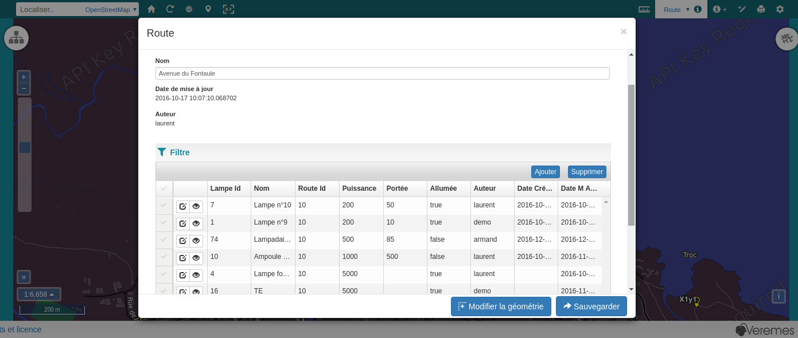

Dans le studio, il faut créer
un élément de type "*Grille - Objet métier*", sélectionner l'objet
métier qui joue le rôle d'enfant et renseigner le lien qu'il existe
entre les deux objets.

Dans le champ "*Lien avec l'objet métier*", le premier champ désigne la
colonne de l'enfant tandis que le deuxième celle de l'enregistrement
parent.

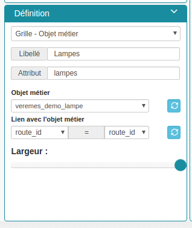

Edition de JavaScript associé à un formulaire  : opérer une conversion rgb/rgba
------------------------------------------------------------------

vMap est un logiciel personnalisable.  Il peut être utilise d'associer du code JavaScript aux différents formulaires.

Le code écrit dans ces formulaires est lancé lors de l'édition,
l'insertion et la visualisation d'un objet métier. Il peut servir par
exemple, à convertir des données avant et après saisie, faire des
concaténations, des requêtes de type Ajax...

La section "*Édition JavaScript*" dans la partie
"*Prévisualisation du studio*" permet d'ouvrir l'éditeur de code :

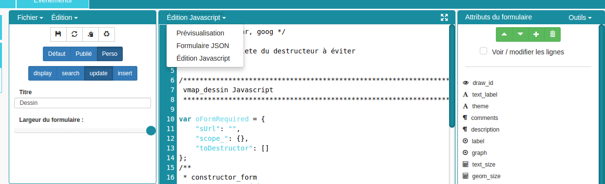

Le script doit être composé d'une fonction **constructor\_form** appelée
lors du chargement. Cette fonction est lancée avec le **scope** du
formulaire en paramètre.

Testons le code suivant:

.. code:: javascript

    /**
     * constructor_form
     * Fonction appelé à l'initialisation du formulaire
     * @param {type} scope
     */
    var constructor_form = function (scope) {
        console.log("constructor_form");
            
        alert('Hello world');

        console.log('scope:', scope);
    };

Ceci va afficher une popup "Hello world" lors de
l'affichage du formulaire, et va écrire le contenu de l'objet scope dans
la console du navigateur (affichable dans les outils de développement).

Analysons le contenu de l'objet **scope**:

::

    "": undefined$$
    ChildScope: function b()
    $$childHead: b
    $$childTail: m
    $$destroyed: false
    $$isolateBindings: Object
    $$listenerCount: Object
    $$listeners: Object
    $$nextSibling: m
    $$phase: null
    $$prevSibling: m
    $$watchers: Array(13)
    $id: 273
    $parent: m
    $root: mcloseModal: function (identifier)
    compileTemplate: function ()
    ctrl: formReader.formReaderController
    custom-form: wd
    executeButtonEvent: function ($event, buttonEvent)
    getLinkFileName: function (url)
    getValidationCssClass: function (sFieldName)
    getWabField: function (oField)
    iDisplayedTab: 0
    initSubformGrid
    Event_Element_0: function ()
    initSubformGridEvent_counter: 9
    isButtonPresent: function (oButton, oField, oTab)
    isFieldPresent: function (oField, oTab, bCheckButtons)
    isFormTextElement: function (sFormElementType)
    isStringNotEmpty: function (element)
    loadSubForm: function (opt_options)
    oFormDefinition: Object
    oFormEventsContainer: m
    oFormValues: Object
    oProperties: Object
    oSubformValues: null
    reloadSelectField: function (oParentSelect, sFormDefinitionName)
    resetFileInputs: function ()
    sFormDefinitionName: "update"
    sFormUniqueName: 1500541427008
    sendForm: function ()
    setFormValues: function (oValues)
    showTabs: true
    submitButton: false
    switchSelectedOptions: function (sFormDefinitionName, oFieldDefinition, sFromSelectName, sToSelectName)
    testElementsValidityTab: function (callback)
    useWab: function ()
    wabGroup: null
    wabState: null
    __proto__: Object

Dans cet objet, trois variables sont essentielles :

-  **sFormDefinitionName :** nom du formulaire utilisé (update, display,
   insert etc..)
-  **oFormDefinition :** définition JSON du formulaire
-  **oFormValues :** valeurs courantes du formulaire

Dans notre cas nous voulons convertir les couleurs de "*rgba*" vers
"*rgb*" et vise versa pour avoir un formulaire en "*rgba*" et une base
de données en "*rgb*".

Ces couleurs sont contenues en base dans les attributs
"*background\_color*", "*contour\_color*" et "*color\_label*". Dans le
formulaire, ces variables sont dans des champs cachés. Les attributs "*background\_color\_rgba*",
"*contour\_color\_rgba*" et "*color\_label\_rgba*" sont également créés pour être exploités lors de
l'utilisation.

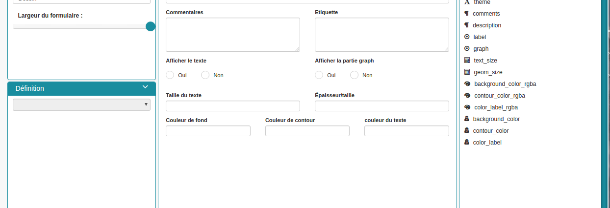

Dans le mode Edition du JavaScript, les fonctions de conversion suivantes sont crées créées :

.. code:: javascript

    var parseColorFromRGBA = function (rgba) {
        if (isRGBA(rgba)) {
            var matchColors = /rgba\((\d{1,3}),(\d{1,3}),(\d{1,3}),(\d{1,3})\)/;
            var match = matchColors.exec(rgba);
            var color = match[1] + ' ' + match[2] + ' ' + match[3];
        } else {
            color = rgba;
        }
        return color;
    };

    var parseColorToRGBA = function (color) {
        if (isRGBA(color))
            var rgba = color;
        else
            var rgba = 'rgba(' + color.replace(/ /g, ',') + ',1)';
        return rgba;
    };

    var isRGBA = function (color) {
        if (color.substring(0, 4) === 'rgba')
            return true;
        else
            return false;
    };

Le code suivant est généré pour convertir de "*rgb*" vers "*rgba*" lors du chargement du formulaire : 

.. code:: javascript

    scope['oFormValues']['update']['background_color_rgba'] = parseColorToRGBA(scope['oFormValues']['update']['background_color']);
    scope['oFormValues']['update']['contour_color_rgba'] = parseColorToRGBA(scope['oFormValues']['update']['contour_color']);
    scope['oFormValues']['update']['color_label_rgba'] = parseColorToRGBA(scope['oFormValues']['update']['color_label']);

Et pour convertir le "*rgba*" vers "*rgb*", le code suivant est implémenté :

.. code:: javascript

    scope['oFormValues']['update']['background_color'] = parseColorFromRGBA(scope['oFormValues']['update']['background_color_rgba']);
    scope['oFormValues']['update']['contour_color'] = parseColorFromRGBA(scope['oFormValues']['update']['contour_color_rgba']);
    scope['oFormValues']['update']['color_label'] = parseColorFromRGBA(scope['oFormValues']['update']['color_label_rgba']);

Le problème avec ce deuxième code c'est qu'il doit être lancé juste
avant que le formulaire ne soit soumis par l'utilisateur car sinon les
changements effectués par ce dernier ne seront pas appliqués.

**Comment effectuer des opérations juste avant l'envoi du formulaire ?**

Dans l'objet "*oFormDefinition*",  il est possible de renseigner des
événements :

-  **beforeEvent :** événement appelé avant envoi au serveur
-  **afterEvent :** événement appelé après l'envoi au serveur

De cette façon,  écrire le code complet :

.. code:: javascript

    /**
     * constructor_form
     * Fonction appelé à l'initialisation du formulaire
     * @param {type} scope
     */
     var constructor_form = function (scope) {
        console.log("constructor_form");

        var parseColorFromRGBA = function (rgba) {
            if (isRGBA(rgba)) {
                var matchColors = /rgba\((\d{1,3}),(\d{1,3}),(\d{1,3}),(\d{1,3})\)/;
                var match = matchColors.exec(rgba);
                var color = match[1] + ' ' + match[2] + ' ' + match[3];
            } else {
                color = rgba;
            }
            return color;
        };

        var parseColorToRGBA = function (color) {
            if (isRGBA(color))
                var rgba = color;
            else
                var rgba = 'rgba(' + color.replace(/ /g, ',') + ',1)';
            return rgba;
        };

        var isRGBA = function (color) {
            if (color.substring(0, 4) === 'rgba')
                return true;
            else
                return false;
        };

        // Lance la conversion de rgb vers rgba au chargement si on est en mode update
        if (angular.isDefined(scope['oFormValues']['update'])) {
            scope['oFormValues']['update']['background_color_rgba'] = parseColorToRGBA(scope['oFormValues']['update']['background_color']);
            scope['oFormValues']['update']['contour_color_rgba'] = parseColorToRGBA(scope['oFormValues']['update']['contour_color']);
            scope['oFormValues']['update']['color_label_rgba'] = parseColorToRGBA(scope['oFormValues']['update']['color_label']);
        }

        // Lance la convertion de rgba vers rgb au beforeEvent
        var beforeEvent = function (sMode) {
            scope['oFormValues'][sMode]['background_color'] = parseColorFromRGBA(scope['oFormValues'][sMode]['background_color_rgba']);
            scope['oFormValues'][sMode]['contour_color'] = parseColorFromRGBA(scope['oFormValues'][sMode]['contour_color_rgba']);
            scope['oFormValues'][sMode]['color_label'] = parseColorFromRGBA(scope['oFormValues'][sMode]['color_label_rgba']);
        };

        // Ajoute BeforeEvent
        scope['oFormDefinition']['update']['beforeEvent'] = function () {
            beforeEvent('update');
        };
        scope['oFormDefinition']['insert']['beforeEvent'] = function () {
            beforeEvent('insert');
        };
    };

Bouton avec événement JavaScript
--------------------------------

Nous avons vu dans l'exemple précédent comment intégrer du code dans un
formulaire objet métier via "*constructor\_form*". Dans ce nouvel exemple, nous
allons créer une fonction qui sera appelée depuis un bouton dans
l'interface.

Bouton Hello world
~~~~~~~~~~~~~~~~~~

Dans une première partie nous allons afficher une popup "Hello world"
lors du clic sur le bouton, pour cela il faudra ajouter un attribut de
type "*Interface - Bouton*" auquel nous allons donner en événement la
fonction **sayHello()**.

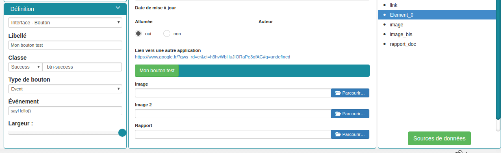

Côté JavaScript, il est important de placer la fonction sur le bon
objet: il faudra la placer sur **le scope de la Main Directive de
Vitis**.

Pour y parvenir il suffit d'appeler
**angular.element(vitisApp.appMainDrtv).scope()**:

.. code:: javascript

    /**
     * constructor_form
     * Fonction appelé à l'initialisation du formulaire
     * @param {type} scope
     */
    var constructor_form = function (scope) {
        console.log("constructor_form");

    };

    /**
     * Fonction à appeler par le bouton
     */
    angular.element(vitisApp.appMainDrtv).scope()["sayHello"] = function(){
        alert('Hello world');
    }

**Remarque:** il est important de vérifier via la console du navigateur
que la fonction n’existe pas déjà car vous pourriez remplacer par erreur
une fonction déjà existante.

Voici le résultat côté client:

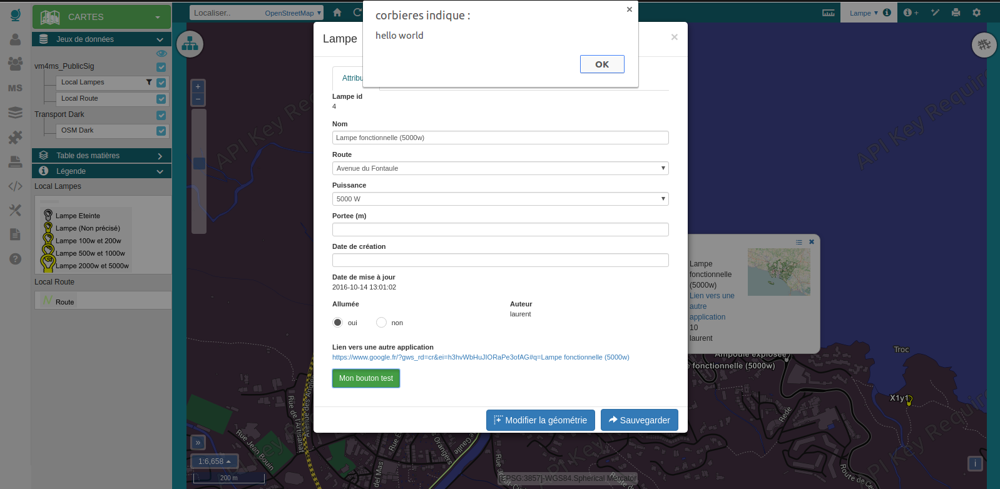

Bouton Ajax
~~~~~~~~~~~

Dans une deuxième partie nous allons lors du clic sur le bouton
effectuer une requête Ajax qui permettra de récupérer les routes donc
l'auteur est "laurent" en base, puis l'on va les écrire dans un champ
texte.

Pour cela je crée un bouton "*Charger les routes*" auquel j'associe la
fonction **loadLaurentRoutes**, et je crée un champ de type "*Texte en
édition - Multiligne*" que j'appelle **routes\_laurent**.

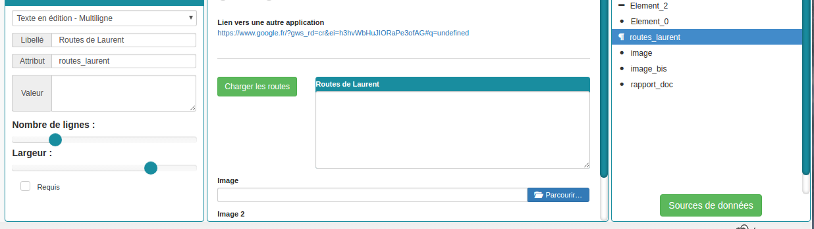

Pour effectuer la requête Ajax il faut utiliser la fonction
**ajaxRequest()** de vMap, au moment de la réponse de la requête je vais
concaténer chacun des résultats dans
**oFormValues.update.routes\_laurent** afin de voir apparaître le
résultat sur l'interface.

Pour avoir accès au scope depuis ma fonction **loadLaurentRoutes**, je
crée une variable globale **oFormRequired** dans laquelle je place mon
scope depuis **constructor\_form**.

Voici le code final:

.. code:: javascript

    var oFormRequired = {
        scope_: {}
    };

    /**
     * constructor_form
     * Fonction appelé à l'initialisation du formulaire
     * @param {type} scope
     */
     constructor_form = function (scope) {
        console.log("constructor_form");

        oFormRequired.scope_ = scope;
    };

    /**
     * Fonction à appeler par le bouton
     */
     angular.element(vitisApp.appMainDrtv).scope()["loadLaurentRoutes"] = function(){
        console.log('loadLaurentRoutes');

        showAjaxLoader();
        ajaxRequest({
            'method': 'GET',
            'url': oVmap['properties']['api_url'] + '/vitis/genericquerys',
            'headers': {
                'Accept': 'application/x-vm-json'
            },
            'params': {
                'schema':'sig',
                'table':'route',
                'filter':{"relation":"AND","operators":[{"column":"auteur","compare_operator":"=","value":"laurent"}]}
            },
            'scope': oFormRequired.scope_,
            'success': function (response) {
                hideAjaxRequest();
                console.log('response', response);

                oFormRequired.scope_['oFormValues']['update']['routes_laurent'] = '';

                if (angular.isDefined(response['data'])){
                    if (angular.isDefined(response['data']['data'])){
                        for (var i = 0; i < response['data']['data'].length; i++) {
                            oFormRequired.scope_['oFormValues']['update']['routes_laurent'] += response['data']['data'][i]['nom'] + ', ';
                        }
                    }
                }
            },
            'error': function (error){
                hideAjaxRequest();
                console.log('error', error);
            }
        });
    };

Désormais quand je clique sur le bouton "*Charger les routes*", cela
remplit le champ "*Routes de laurent*" |image|

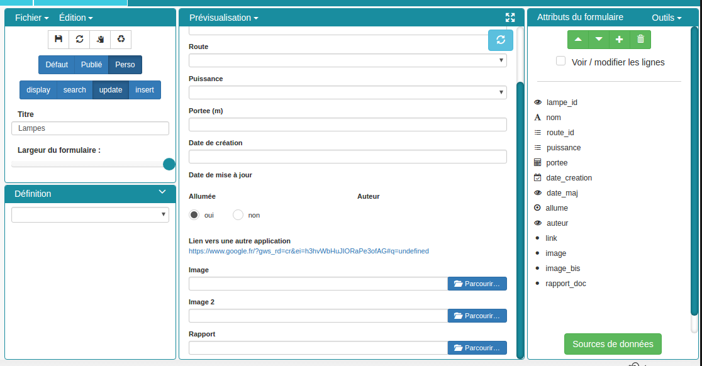
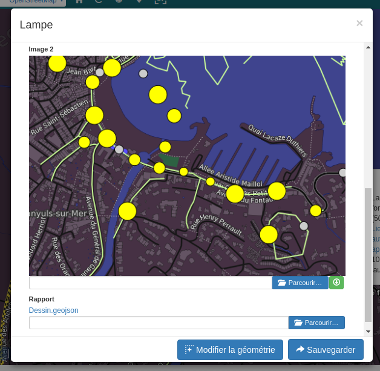
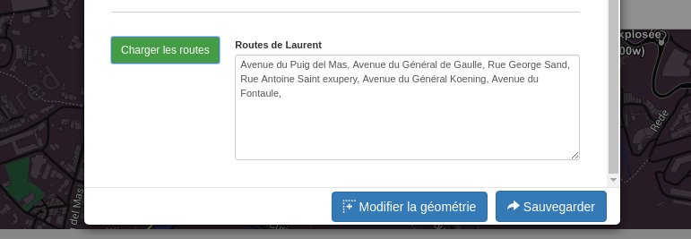

