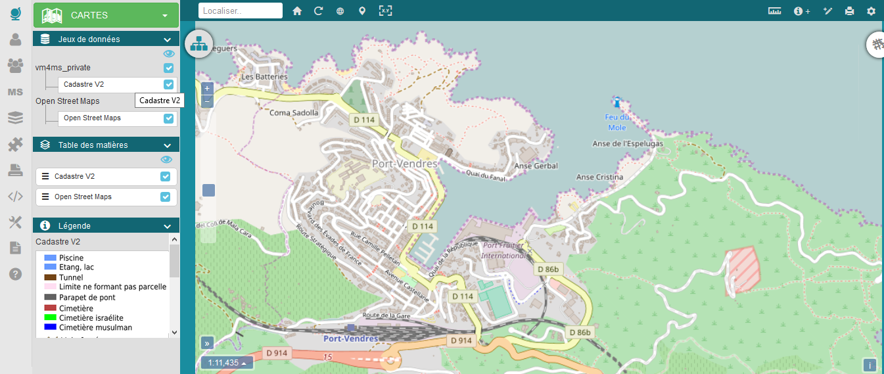

# Visualisation cartographique

## 1. Définition

Le mode visualisation cartographique, accessible aux utilisateurs en
ayant droits (vmap\_user) permet l'affichage des cartes. La liste des
cartes disponibles pour l'utilisateur connecté dépend des groupes
auxquels il appartient.

## 2. La gestion des cartes

## 3. Les outils d'affichage, de sélection, d'interrogation et de filtre

On retrouve dans le volet "Carte" l'ensemble des fonctionnalités
classiques d'un web SIG mais aussi plusieurs fonctionnalités propres à
vMap :

-   La barre de zoom sur le côté gauche (le zoom peut aussi être
    effectué avec la souris)
-   L'échelle et l'overview en bas à gauche
-   Les coordonnées de la souris en bas à droite
-   Les listes des outils de contrôle en haut à droite. Les outils de
    contrôles peuvent être activés ou désactivés à la volée par
    l'utilisateur
-   La liste des modèles d'impressions disponibles pour
    l'utilisateur connecté. L'ensemble des champs paramétrables pour les
    impressions sont définis par l'administrateur dans le modèle que ce
    dernier aura mis en place. Dans l'exemple ci dessus, l'impression
    requiert trois paramètres, un titre, un sous-titre et une source
-   Un outil d'insertion d'une donnée
-   Un outil de sélection multiple qui se découpe en deux possibilités.
    Une sélection graphique à partir des outils point, ligne, polygone
    et cercle; ou une sélection attributaire à partir d'un formulaire
    filtrable et triable. Prérequis : Un objet métier doit
    obligatoirement être associé à un calque de la carte.
-   Un outil de sélection simple permettant d'obtenir les informations
    attributaire d'un seul et unique objet sélectionné géographiquement.
    Prérequis : Un objet métier doit obligatoirement être associé à un
    calque de la carte.
-   Un outil de mesure
-   Un outil de localisation à partir des coordonnées X et Y et d'un
    système de projection.
-   Un outil de géolocalisation.
-   Un outil pour centrer la carte sur l'étendue maximale. L'étendue
    maximale d'une carte diffère en fonction du système de projection.
    Si la carte est en Lambert 93, l'étendue maximale de la carte sera
    la France.
-   Un outil pour rafraichir les couches de la carte sans avoir à
    recharger l'application
-   Un outil pour recentrer la carte sur l'emprise par défaut définie
    par l'administrateur
-   Et enfin un outil de localisation. Par défaut l'outil de
    localisation fonctionne avec la couche Open Street Map. Par
    ailleurs, si un objet métier est associé à un calque de la carte, un
    choix sera disponible entre plusieurs localisations.
