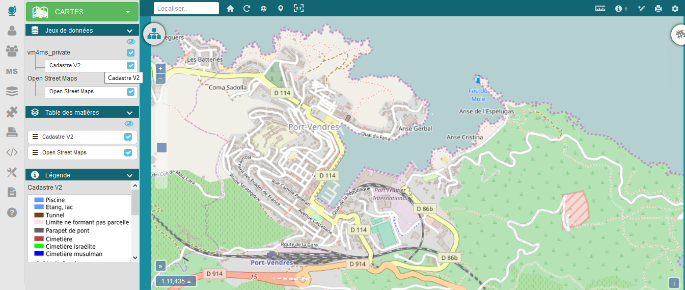

Visualisation cartographique
============

1. Définition
-------------
Le mode visualisation cartographique, accessible aux utilisateurs en ayant droits (vmap_user) permet l'affichage des cartes. La liste des cartes disponibles pour l'utilisateur connecté dépend des groupes auxquels il appartient.

2. La gestion des cartes
-------------------------

3. Les outils d'affichage, de sélection, d'interrogation et de filtre 
---------------

